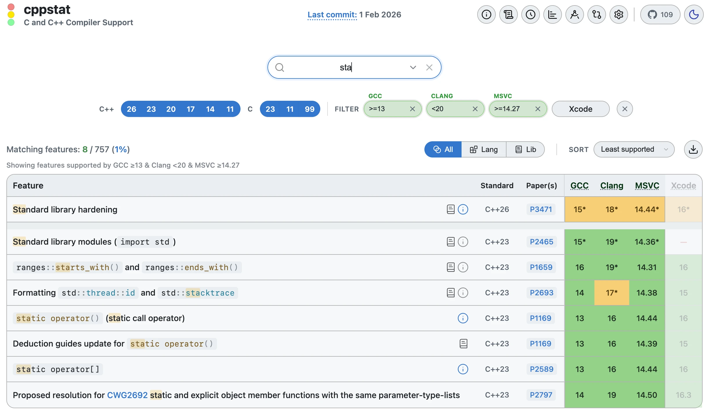
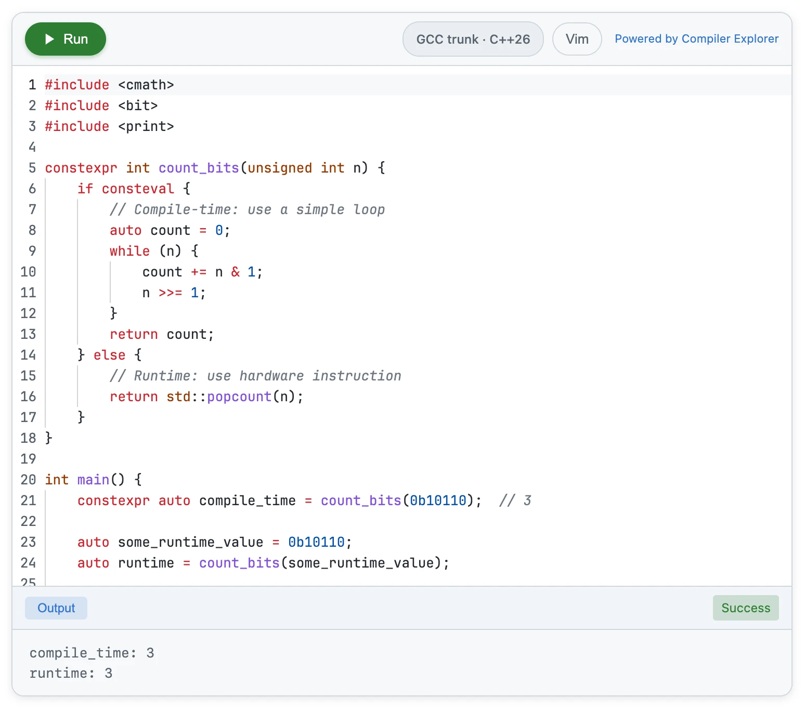

<div class="title-block" style="text-align: center;" align="center">

**[cppstat.dev]**

[cppstat.dev]: https://cppstat.dev

---

<picture>
  <source media="(prefers-color-scheme: dark)" srcset="assets/cover_dark.webp">
  <source media="(prefers-color-scheme: light)" srcset="assets/cover_light.webp">
  
</picture>

</div>

---

cppstat is a site that lists C and C++ features and their respective support by compilers and standard libraries, designed as a simple, quickly searchable table.

## Contributing

cppstat is generated from YAML data files in the root directory.
The files are maintained as a best-effort and contributions are always welcome.

You can edit these files directly via GitHub's web interface and commit your changes for approval.

Alternatively, you can [submit a ticket](https://github.com/cdervis/cppstat/issues) for any incorrect or missing information, or feature ideas.

If you are a toolchain developer, feel free to request full editorial access.

---

### Feature Lists

Features are declared in the `features_cpp<version>.yaml` files.
Each standard version of C and C++ has its own file; for example, `features_cpp23.yaml` contains all features of C++23.

A feature has the following properties:

- `desc`: The title and / or description of the feature. Supports Markdown.
- `paper`: One or multiple paper numbers that belong to the feature.
- `lib`: If true, the feature counts as a standard library feature. (default: `false`)
- `support`: A list of toolchains that support the feature.
  - A toolchain must be in the form of `<name> <version>`, e.g. `GCC 16` and `MSVC 14.50`.
    - If no version is specified, e.g. `GCC`, then that toolchain supports the feature in general.
  - Adding a `(partial)` or `(hint)` suffix declares partial support or a hint.
- `hints`: A list of hints targeting toolchains in the `support` list, where each entry has:
  - `target`: The toolchain that this hint targets
  - `msg`: The reason for partial support, or the hint. Supports Markdown.
- `ftm`: A list of feature-testing macros (FTM) for the feature, where each entry has:
  - `name`: The name of the FTM, e.g. `__cpp_lib_not_fn`
  - `value`: The value of the FTM, e.g. `201603L`
- `content`: Information about the feature (see below)
- `keywords`: A list of keywords to categorize the feature. The feature will be included in search results when searching for these keywords.

As a **full** reference example, here is the definition of P2465 at the time of writing:

```yaml
- desc: 'Standard library modules (`import std`)'
  paper: P2465
  lib: true
  support:
    - GCC 15 (hint)
    - Clang 17 (partial)
    - Clang 19
    - MSVC 14.50 (partial)
    - MSVC 14.55
  hints:
    - target: GCC 15
      msg: 'Requires enabling compiler flag `-fmodules` to enable experimental modules support.'
    - target: Clang 17
      msg: 'Experimental support only.'
    - target: MSVC 14.50
      msg: 'Modules work, but you have to manually add them to your Visual Studio project.'
  ftm:
    - name: __cpp_lib_modules
      value: 202207L
```

Which will look like the following on cppstat:


---

### Feature Content

Every feature can have an in-depth explanation hidden behind its info button.

The `content` property of a feature specifies the **Markdown file** that describes the feature.
This file is expected to be in the `content` folder.

For example, the feature P2589 (`static operator[]`) is defined as follows:

```yaml
- desc: '`static operator[]`'
  ...
  content: static-subscript-operator.md
```

This feature's explanation is therefore expected to be in `content/static-subscript-operator.md`.

The structure of a content file should be:
  1. **What It Does**: Explains to the reader briefly and in easy-to-understand terms what the function does.
  2. **Why It Matters**: Explains the background to why the function was originally standardized, e.g. what historical problems it solves.
  3. **Example**: A short, interactive example how the feature can be used in code.

#### Code Editors

Each feature should include a sample snippet that shows how it can be used in code.
The snippet helps the reader to better understand the feature and to try it out directly in the browser.

Markdown multiline code blocks are expected (triple backticks).
For C++ feature's, a `cpp` block is expected; for C it's `c`.

Example of how it looks on cppstat:

<picture>
  <source media="(prefers-color-scheme: dark)" srcset="assets/feature_example_editor_dark.webp">
  <source media="(prefers-color-scheme: light)" srcset="assets/feature_example_editor_light.webp">
  
</picture>

The frontmatter of a content file can specify the following properties:

- **execute**: If `true`, allows execution of the program. (default: `false`)
- **flags**: Extra flags to pass to the compiler. (default: latest standard of the feature's language + `-O2`)
- **show_assembly**: If `true`, adds an assembly output tab to the compilation result. (default: `false`)

---

### Toolchains

Toolchains are declared in the `toolchains.yaml` file.

Note that the list does not contain every possible toolchain release, but rather the toolchains that are referenced by a feature.
This is mostly major and minor releases, very rarely revisions.

Each toolchain has the following properties:

- `name`: The name and version of the toolchain, e.g. `GCC 11.5`
- `released`: The official release date of the toolchain, e.g. `July 19, 2024`
- `refs`: An **optional** list of related websites, such as release note links

MSVC has the following additional properties:

- `part_of`: The version of Visual Studio that the MSVC release was a part of, e.g. `Visual Studio 2019 version 16.1`

Xcode has the following additional properties:

- `apple_clang`: The version of the Apple Clang compiler that was part of the Xcode release, e.g. `13.0.0 (clang-1300.0.29.3)`
