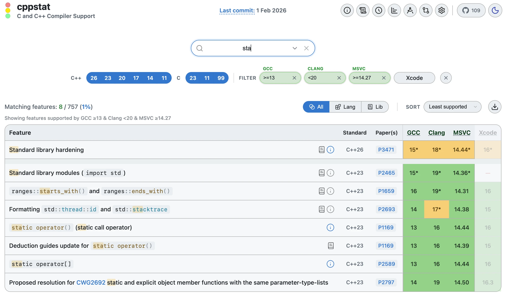
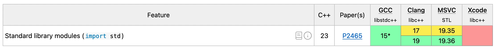

<div class="title-block" style="text-align: center;" align="center">

**[cppstat.dev]**

[cppstat.dev]: https://cppstat.dev

<picture>
  <source media="(prefers-color-scheme: dark)" srcset="assets/cover_dark.webp">
  <source media="(prefers-color-scheme: light)" srcset="assets/cover_light.webp">
  
</picture>

</div>

---

cppstat is a site that lists C and C++ features and their respective support by compilers and standard libraries, designed as a simple, quickly searchable table.

## Contributing

cppstat fetches data from YAML files in the root directory.
The files are maintained as a best-effort and contributions are always welcome.

Simply use GitHub's web interface or fork the repo to commit your changes for approval.
Another approach is to [submit a ticket](https://github.com/cdervis/cppstat/issues) for any incorrect or missing information, or feature ideas.

You can preview the data on a fork's `main` branch at `https://cppstat.dev/?repo=<owner>/<repository>`.

**If you are a tool developer, feel free to request full editorial access.**

---

### Feature Lists

Features are declared in the `features_cpp<version>.yaml` files.
Each standard version of C and C++ has its own file; for example, `features_cpp23.yaml` contains all features of C++23.

A feature has the following properties:

- **`desc`**: The title and / or description of the feature. Supports Markdown.
- **`paper`**: One or multiple paper numbers that belong to the feature.
- **`lib`**: If true, the feature counts as a standard library feature. (default: `false`)
- **`support`**: A list of tools that support the feature.
  - A compact entry uses `<name> <version>`, e.g. `GCC 16` and `MSVC 14.50`.
    - If no version is specified, e.g. `GCC`, then that tool supports the feature in general.
    - A trailing `(partial)` suffix declares partial support.
  - Use an object when an entry needs metadata:
    - **`tool`**: The complete tool name and optional version. This field is required.
    - **`status`**: `full`, `partial`, or `unsupported`. It defaults to `full`.
    - **`note`**: Additional context. Notes support Markdown.
    - **`issue`**: An issue identifier for the resolved tool. The tool's frontend metadata must define an issue-tracker URL template.
- **`ftm`**: A list of feature-testing macros (FTM) for the feature, where each entry has:
  - **`name`**: The name of the FTM, e.g. `__cpp_lib_not_fn`
  - **`value`**: The value of the FTM, e.g. `201603L`
- **`content`**: Information about the feature (see below)
- **`keywords`**: A list of keywords to categorize the feature. The feature will be included in search results when searching for these keywords.

Compact and structured entries can be mixed in the same feature-owned list:

```yaml
support:
  - GCC 15
  - Clang 18 (partial)
  - R++ 2026.2
  - tool: MSVC 14.14
    note: Not supported in C++14 mode.
  - tool: R++ 2026.1
    status: partial
    issue: RSCPP-38421
    note: Earlier releases supported only part of the feature.
```

The resolved frontend metadata supplies the URL template for `issue`; support records themselves store only the identifier.

As a **full** reference example, here is the definition of P2465 at the time of writing:

```yaml
- desc: 'Standard library modules (`import std`)'
  paper: P2465
  lib: true
  support:
    - tool: GCC 15
      note: 'Requires enabling compiler flag `-fmodules` to enable experimental modules support.'
    - tool: Clang 17
      status: partial
      note: 'Experimental support only.'
    - Clang 19
    - tool: MSVC 14.35
      status: partial
      note: 'Modules work, but you have to manually add them to your Visual Studio project.'
    - MSVC 14.36
  ftm:
    - name: __cpp_lib_modules
      value: 202207L
```

Which will look like the following on cppstat:



---

### Feature Content

Every feature can have an in-depth explanation hidden behind its info button.

The **`content`** property of a feature specifies the **Markdown file** that describes the feature.
This file is expected to be in the `content` folder.

For example, the feature P2589 (`static operator[]`) is defined as follows:

```yaml
- desc: '`static operator[]`'
  ...
  content: static-subscript-operator.md
```

This feature's explanation is therefore expected to be in `content/static-subscript-operator.md`.

The structure of a content file should be:
  1. **What It Does**: Explains to the reader briefly and in easy-to-understand terms what the function does.
  2. **Why It Matters**: Explains the background to why the function was originally standardized, e.g. what historical problems it solves.
  3. **Example**: A short, interactive example how the feature can be used in code.

### Tools

cppstat lists toolchains and frontends.
Toolchains are declared in `toolchain_<id>.yaml` files, while frontends are declared in `frontend_<id>.yaml` files.

Note that the list does not contain every possible tool release, but rather the tools that are referenced by a feature. This is mostly major and minor releases, very rarely revisions.

#### Toolchains

Each toolchain has the following properties:

- `name`: The name and version of the toolchain, e.g. `GCC 11.5`
- `released`: The official release date of the toolchain, e.g. `July 19, 2024`
- `refs`: An **optional** list of related websites, such as release note links

MSVC has the following additional properties:

- `part_of`: The version of Visual Studio that the MSVC release was a part of, e.g. `Visual Studio 2019 version 16.1`

Xcode has the following additional properties:

- `apple_clang`: The version of the Apple Clang compiler that was part of the Xcode release, e.g. `13.0.0 (clang-1300.0.29.3)`

#### Frontends

Each `frontend_<id>.yaml` file describes a language frontend and its known releases.

The `frontend` object has the following properties:

- **`id`**: A stable identifier used in the filename, e.g. `rscpp`
- **`name`**: The short name used in feature support entries, e.g. `R++`
- **`full_name`**: The frontend's full product name
- **`vendor`**: The vendor or maintainer
- **`description`**: An optional explanation shown when hovering the frontend's table column
- **`kind`**: Always `frontend`
- **`standard_library`**: Whether the frontend also provides a standard library implementation
- **`products`**: Products that include the frontend
- **`refs`**: Related project or product links, each with a `title` and `url`

A file may also define an `issue_tracker` with a display `name` and a `url_template` containing `{id}`.
This allows structured support entries to refer to issues by identifier.

The `releases` list declares valid frontend versions. Each release has a `version`, an optional `released` date,
and a list of titled `refs`, such as release notes.
Feature support entries that name a frontend version must reference one of these declared releases.

```yaml
---
frontend:
  id: rscpp
  name: R++
  full_name: ReSharper C++
  vendor: JetBrains
  description: >-
    R++ is the C and C++ language engine powering code analysis and language
    support in CLion, Rider, and ReSharper C++ for Visual Studio.
  kind: frontend
  standard_library: false
  products: [CLion, Rider, ReSharper C++ for Visual Studio]
  refs:
    - title: Product page
      url: https://www.jetbrains.com/resharper-cpp/
issue_tracker:
  name: JetBrains YouTrack
  url_template: https://youtrack.jetbrains.com/issue/{id}
releases:
  - version: "2026.2"
    released: July 22, 2026
    refs:
      - title: Release notes
        url: https://www.jetbrains.com/resharper-cpp/whatsnew/
```
