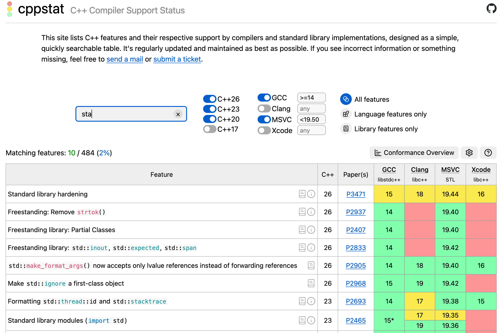

<picture>
  <source media="(prefers-color-scheme: dark)" srcset="Misc/LogoDark.png">
  <source media="(prefers-color-scheme: light)" srcset="Misc/LogoLight.png">
  
</picture>

**[cppstat.dev]**

[cppstat.dev]: https://cppstat.dev

---

<picture>
  <source media="(prefers-color-scheme: dark)" srcset="Misc/cover-dark.webp">
  <source media="(prefers-color-scheme: light)" srcset="Misc/cover-light.webp">
  
</picture>

---

cppstat is a site that lists C++ features and their respective support by compilers and standard libraries, designed as a simple, quickly searchable table.

This repository serves as a place to submit missing or incorrect information, or just all around feedback.

